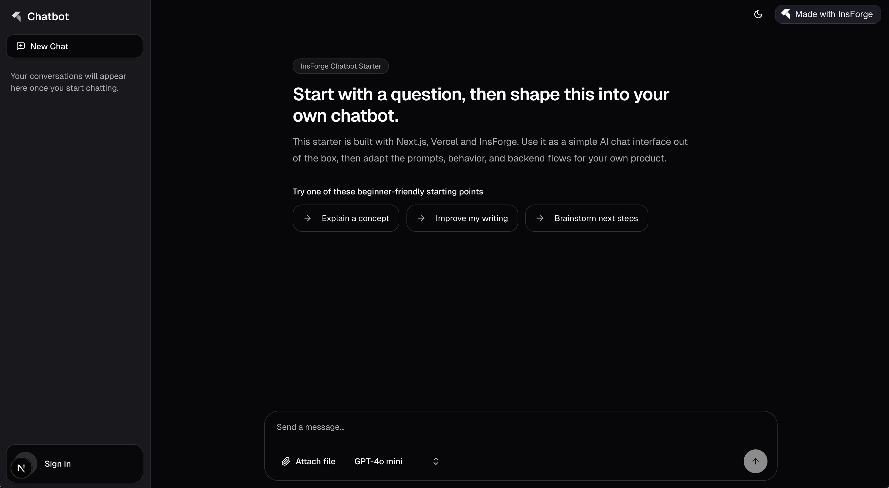

<a href="https://insforge.dev">
  <h1 align="center">InsForge Chatbot Starter</h1>
</a>

<p align="center">
  A Next.js chatbot starter with InsForge auth, database, storage, and optional Vercel AI Gateway support.
</p>

<p align="center">
  <a href="#features"><strong>Features</strong></a> ·
  <a href="#demo"><strong>Demo</strong></a> ·
  <a href="#quick-launch"><strong>Quick Launch</strong></a> ·
  <a href="#run-locally"><strong>Run locally</strong></a> ·
  <a href="#vercel-ai-gateway"><strong>Vercel AI Gateway</strong></a> ·
  <a href="#deploy-to-vercel"><strong>Deploy to Vercel</strong></a> ·
  <a href="#first-try"><strong>First Try</strong></a>
</p>



<br/>

## Features

- [Next.js](https://nextjs.org) App Router
- Streaming chat UI with persisted history and file attachments
- [InsForge](https://insforge.dev) auth, database, storage, and AI
- Optional routing through [Vercel AI Gateway](https://vercel.com/docs/ai-gateway)
- Multi-provider model selection with `provider/model` IDs
- [shadcn/ui](https://ui.shadcn.com) components
- Styling with [Tailwind CSS](https://tailwindcss.com)

## Demo

Demo: [insforge-chatbot-starter.vercel.app](https://insforge-chatbot-starter.vercel.app/)

The starter includes a simple first-try chat experience, persisted history, file uploads, authentication, and optional routing through the Vercel AI Gateway.

## Quick Launch

If you want the fastest path, use the InsForge CLI and follow the prompts:

```bash
npx @insforge/cli create
```

From there:

1. Choose the chatbot template
2. Create or connect your InsForge project
3. Let the CLI set up the project files
4. Choose to deploy with [Vercel](https://vercel.com) automatically from the guided flow

Use the local setup below if you want to inspect the repo, edit environment variables manually, or control the setup step by step.

## Run locally

1. Clone the repository and move into the chatbot template:

   ```bash
   git clone https://github.com/InsForge/insforge-templates.git
   cd insforge-templates/chatbot
   ```

2. Install dependencies:

   ```bash
   npm install
   ```

3. Copy the example environment file:

   ```bash
   cp .env.example .env.local
   ```

4. Fill in the required values:

   ```env
   NEXT_PUBLIC_INSFORGE_URL=https://your-project.region.insforge.app
   NEXT_PUBLIC_INSFORGE_ANON_KEY=your-public-anon-key
   NEXT_PUBLIC_APP_URL=http://localhost:3000
   ```

5. Apply the included schema to your InsForge project:

   ```bash
   insforge db import migrations/db_init.sql
   ```

   This migration creates the chat tables and also inserts the `chat-attachments` storage bucket record used by file uploads.

6. Start the dev server:

   ```bash
   npm run dev
   ```

7. Open [http://localhost:3000](http://localhost:3000)

## Vercel AI Gateway

To route AI requests through the [Vercel AI Gateway](https://vercel.com/docs/ai-gateway) instead of InsForge AI:

1. Enable the provider:

   ```env
   AI_PROVIDER=vercel
   AI_GATEWAY_API_KEY=your-gateway-api-key
   ```

   On Vercel deployments `AI_GATEWAY_API_KEY` is optional — the gateway authenticates automatically via OIDC.

2. Add provider credentials for the models you want to use. To get started, `OPENAI_API_KEY` is enough for `openai/*` models:

   ```env
   OPENAI_API_KEY=sk-...
   ```

   If you want to use other providers from the model picker, add the matching provider key in your environment or configure it in Vercel AI Gateway settings. Selecting a model whose provider key is missing will return a clear error in the chat UI — there is no silent fallback to another provider.

   Alternatively, if deploying on Vercel, you can configure provider keys in the Vercel dashboard under AI Gateway settings instead of using environment variables.

**Current limitations:**
- PDF file parsing (`fileParser`) is InsForge-only. PDFs are forwarded as base64 file parts, but results depend on the model. A toast warning is shown when this applies.
- InsForge is still required for auth, database, storage, and file uploads regardless of AI provider.

## Deploy to Vercel

After cloning the repo and running the starter locally, you can deploy it on Vercel:

[](https://vercel.com/new/clone?repository-url=https%3A%2F%2Fgithub.com%2FInsForge%2Finsforge-templates&root-directory=chatbot&project-name=insforge-chatbot&repository-name=insforge-chatbot&env=NEXT_PUBLIC_INSFORGE_URL,NEXT_PUBLIC_INSFORGE_ANON_KEY&envDescription=Connect%20your%20InsForge%20project%20URL%20and%20anon%20key.&external-id=https%3A%2F%2Fgithub.com%2FInsForge%2Finsforge-templates%2Ftree%2Fmain%2Fchatbot&demo-title=InsForge%20Chatbot%20Starter&demo-description=A%20Next.js%20chatbot%20starter%20with%20InsForge%20auth%2C%20database%2C%20storage%2C%20and%20optional%20Vercel%20AI%20Gateway%20support.&demo-image=https%3A%2F%2Fraw.githubusercontent.com%2FInsForge%2Finsforge-templates%2Fmain%2Fchatbot%2Fpublic%2Fchatbot-readme-cover.png)

1. Set `NEXT_PUBLIC_INSFORGE_URL`
2. Set `NEXT_PUBLIC_INSFORGE_ANON_KEY`
3. Deploy the project
4. In Vercel, open your project, go to `Settings` → `Environment Variables`, and set `NEXT_PUBLIC_APP_URL` to your deployed app URL
5. Redeploy the project
6. In the InsForge dashboard, open `Authentication` → `General` → `Allowed Redirect URLs`, then add your deployed callback URL (for example `https://your-project.vercel.app/auth/callback`)

## First Try

The empty chat state starts with a welcome heading and three beginner-friendly starter prompts ("Explain a concept", "Improve my writing", "Brainstorm next steps") so you can try the template quickly on localhost or a cloud preview. Selecting a starter prompt fills the input first, so you can adjust it before sending. The prompts are defined in [`components/chat-empty-state.tsx`](./components/chat-empty-state.tsx) and are easy to replace with your own product's use cases.
