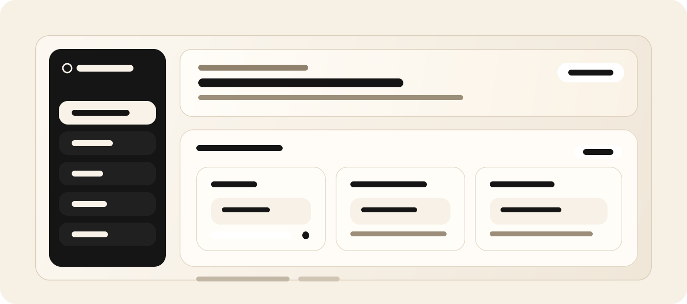

<p align="center">
  
</p>

# InsForge CRM Starter

An authenticated CRM starter built with Next.js, shadcn/ui, and InsForge. It ships with a visual sales pipeline, lead activity tracking, client conversion flows, project management, and enough structure for developers to adapt it into their own CRM without rebuilding auth, database access, or storage from scratch.

Inspired by the developer experience of Supabase and Vercel starter repositories, this template is designed to be modified, not just demoed.

Build a CRM with InsForge auth, database, storage, and RLS without starting from a blank dashboard.

By default, authenticated users land on a dedicated `Developer Guide` page. If you want the starter to open directly on the CRM dashboard instead, change `DEFAULT_LANDING_ROUTE` in `lib/constants.ts` to `/dashboard`.

## Who this starter is for

- Teams building a custom CRM on top of InsForge auth, database, and storage
- Agencies and consultancies that need lead, client, and project workflows
- Developers who want a concrete example of RLS-protected CRUD in a Next.js app
- Product teams evaluating how InsForge-backed server components and API routes fit together

## Features

- Lead management with CRUD, scoring, notes, and ownership metadata
- Drag-and-drop pipeline for visualizing stages and moving leads forward
- Lead activities, follow-ups, and document uploads
- Lead-to-client conversion flow
- Client and project management screens
- InsForge authentication with email/password and OAuth providers
- Row Level Security policies that scope CRM records to the authenticated user
- Shared UI primitives built with shadcn/ui patterns

## Quick start

```bash
npm install
cp .env.example .env.local
```

Populate `.env.local` with your InsForge project values:

| Variable | Required | Description |
| --- | --- | --- |
| `NEXT_PUBLIC_INSFORGE_URL` | Yes | Your InsForge project URL |
| `NEXT_PUBLIC_INSFORGE_ANON_KEY` | Yes | Public/anon key for the linked project |
| `NEXT_PUBLIC_APP_URL` | Yes for production OAuth | Public app URL used for OAuth callbacks outside local development |

Apply the CRM schema:

```bash
insforge db import migrations/db_init.sql
```

Then start the app:

```bash
npm run dev
```

Open [http://localhost:3000](http://localhost:3000), sign up your first user, and use the in-app `Seed CRM defaults` action on the dashboard to create sample lead sources and pipeline stages.

## Backend setup

The starter expects the database objects defined in `migrations/db_init.sql`:

- `leads`, `clients`, `projects`, and related activity tables
- `lead_sources` and `lead_stages`
- the `seed_crm_defaults` RPC for first-run starter data
- the `update_lead_stage` RPC for pipeline moves
- RLS policies scoped to `auth.uid()`
- the `lead-documents` storage bucket

If you skip the migration or point the app at a project with a different schema, the server-rendered dashboard will fail immediately because the starter queries these tables on first load.

## Developer onboarding

The starter is intentionally opinionated, but the main extension points are concentrated in a few places:

- `migrations/db_init.sql`: tables, policies, helper RPCs, and starter seed data
- `lib/queries.ts`: server-side CRM query layer
- `app/(dashboard)`: route-level composition for the dashboard, leads, clients, and projects
- `components/leads/*`: pipeline board, lead detail, and lead creation UI
- `app/api/*`: examples of authenticated route handlers that call into the same query layer

If you only read one file before customizing the project, start with `lib/queries.ts` and then inspect the corresponding route in `app/(dashboard)`.

## Common customizations

### Add custom lead fields

1. Add the column in `migrations/db_init.sql`
2. Re-run the migration against your InsForge project
3. Update the TypeScript payloads in `lib/queries.ts`
4. Expose the field in `components/leads/add-lead-form.tsx` and `components/leads/lead-detail.tsx`

### Change pipeline stages

Use the seeded defaults as an example, then insert or rename stages in `lead_stages`.

```sql
insert into public.lead_stages (name, order_index, user_id)
values ('Qualified', 2, auth.uid());
```

### Replace starter data

The dashboard includes a `Seed CRM defaults` action that calls `/api/seed`. You can:

- adjust the `seed_crm_defaults` RPC in `migrations/db_init.sql`
- keep the RPC and swap the inserted records
- remove the button entirely if you do not want seeded data in your product

### Extend the CRM routes

To add a new page:

1. create a route under `app/(dashboard)`
2. add the data access function to `lib/queries.ts`
3. link it from `components/layout/sidebar.tsx`

## Architecture

This starter follows a simple pattern:

- Server components and route handlers call into `lib/queries.ts`
- `lib/queries.ts` uses the InsForge SDK in server mode
- Auth state is stored in cookies and refreshed through `lib/auth-*`
- The database enforces user isolation through RLS
- UI state stays lightweight and mostly local to the feature components

That keeps the project approachable for developers who want to trace how a lead moves from form input to database write without learning a large framework abstraction first.

## Verification checklist

Before sharing or deploying the starter, verify:

- `npm run typecheck` passes
- the schema import completed successfully
- sign-up and sign-in both work
- the dashboard loads without missing-table errors
- seeding creates lead sources and pipeline stages
- dragging a lead across stages updates the pipeline
- document upload works against the `lead-documents` bucket

## Notes

- All InsForge calls happen on the server through Next.js API routes and server components.
- The drag-and-drop pipeline uses `@hello-pangea/dnd` with optimistic UI updates.
- The current project is intentionally single-user scoped through RLS. Multi-user collaboration is a good next customization step if you need team CRM behavior.
