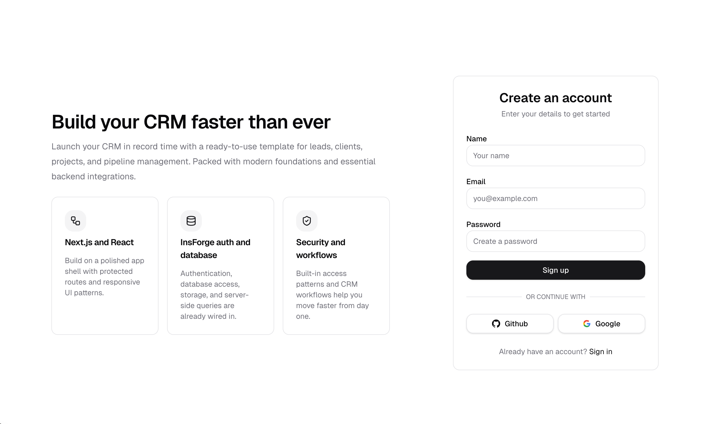

# InsForge CRM Starter

A developer-friendly CRM starter built with Next.js, shadcn/ui, and InsForge.

**[Features](#features)** · **[Demo](#demo)** · **[Quick launch](#quick-launch)** · **[Step-by-step setup](#step-by-step-setup)** · **[Deploy](#deploy-with-vercel)** · **[Customization](#common-customizations)**




An authenticated CRM starter built with Next.js, shadcn/ui, and InsForge. It ships with a visual sales pipeline, lead activity tracking, client conversion flows, project management, and enough structure for developers to adapt it into their own CRM without rebuilding auth, database access, or storage from scratch.

Inspired by the developer experience of Supabase and Vercel starter repositories, this template is designed to be modified, not just demoed.

Build a CRM with InsForge auth, database, storage, and RLS without starting from a blank dashboard.

By default, authenticated users land on a dedicated `Developer Guide` page. If you want the starter to open directly on the CRM dashboard instead, change `DEFAULT_LANDING_ROUTE` in `lib/constants.ts` to `/dashboard`.

---

## Features

- Lead management with CRUD, scoring, notes, and ownership metadata
- Drag-and-drop pipeline for visualizing stages and moving leads forward
- Lead activities, follow-ups, and document uploads
- Lead-to-client conversion flow
- Client and project management screens
- [InsForge](https://insforge.dev) authentication with email/password and OAuth providers
- Row Level Security policies that scope CRM records to the authenticated user
- Shared UI primitives built with shadcn/ui patterns

---

## Demo

Demo: [3pvjpunq.insforge.site](https://3pvjpunq.insforge.site/)

The template includes a dedicated in-app developer guide, a CRM dashboard, lead and client management, and a seeded pipeline flow for first-run evaluation.

---

## Quick launch

If you want the fastest path, use the InsForge CLI and follow the prompts:

```bash
npx @insforge/cli create
```

From there:

1. Choose the CRM template
2. Follow the prompt flow to create or connect your InsForge project
3. Let the CLI handle the initial setup
4. Choose to deploy with [Vercel](https://vercel.com) automatically from the guided flow

Use the step-by-step setup below if you want to inspect the repo, edit environment variables manually, or control the migration flow yourself.

---

## Step-by-step setup

### 1. Clone the repository

If you have not already done so, clone the repository and install dependencies:

```bash
git clone https://github.com/InsForge/insforge-templates.git
cd insforge-templates/crm
npm install
```

### 2. Create an InsForge project

Create a new [InsForge](https://insforge.dev) project in your dashboard. You will need:

- your project URL, available in `Project -> Settings`
- your anon/public key, available in `Project -> Settings`

### 3. Configure environment variables

Copy the example file:

```bash
cp .env.example .env.local
```

Then populate `.env.local` with your project values:


| Variable                        | Required                 | Description                                                       |
| ------------------------------- | ------------------------ | ----------------------------------------------------------------- |
| `NEXT_PUBLIC_INSFORGE_URL`      | Yes                      | Your InsForge project URL                                         |
| `NEXT_PUBLIC_INSFORGE_ANON_KEY` | Yes                      | Public/anon key for the linked project                            |
| `NEXT_PUBLIC_APP_URL`           | Yes for production OAuth | Public app URL used for OAuth callbacks outside local development |


For local development, set `NEXT_PUBLIC_APP_URL=http://localhost:3000`.

### 4. Apply the CRM schema

Run the included migration against your InsForge project:

```bash
insforge db import migrations/db_init.sql
```

This creates the CRM tables, RLS policies, storage bucket, and helper RPCs used by the starter.

### 5. Run the app

```bash
npm run dev
```

Open [http://localhost:3000](http://localhost:3000), sign up your first user, and use the in-app `Seed CRM defaults` action from the developer guide to create sample lead sources and pipeline stages.

---

## Deploy with Vercel

To deploy the starter on Vercel:

1. Import the repository into Vercel
2. Set `NEXT_PUBLIC_INSFORGE_URL`
3. Set `NEXT_PUBLIC_INSFORGE_ANON_KEY`
4. Set `NEXT_PUBLIC_APP_URL` to your deployed app URL
5. Deploy the project
6. Run `insforge db import migrations/db_init.sql` against the linked InsForge project if you have not already applied the schema

After deploying, sign in, confirm the dashboard loads successfully, and seed the default CRM data if needed.

---

## Common customizations

### Add custom lead fields

1. Add the column in `migrations/db_init.sql`
2. Re-run the migration against your InsForge project
3. Update the TypeScript payloads in `lib/queries.ts`
4. Expose the field in `components/leads/add-lead-form.tsx` and `components/leads/lead-detail.tsx`

### Change pipeline stages

Use the seeded defaults as an example, then insert or rename stages in `lead_stages`.

```sql
insert into public.lead_stages (name, order_index, user_id)
values ('Qualified', 2, auth.uid());
```

### Replace starter data

The dashboard includes a `Seed CRM defaults` action that calls `/api/seed`. You can:

- adjust the `seed_crm_defaults` RPC in `migrations/db_init.sql`
- keep the RPC and swap the inserted records
- remove the button entirely if you do not want seeded data in your product
